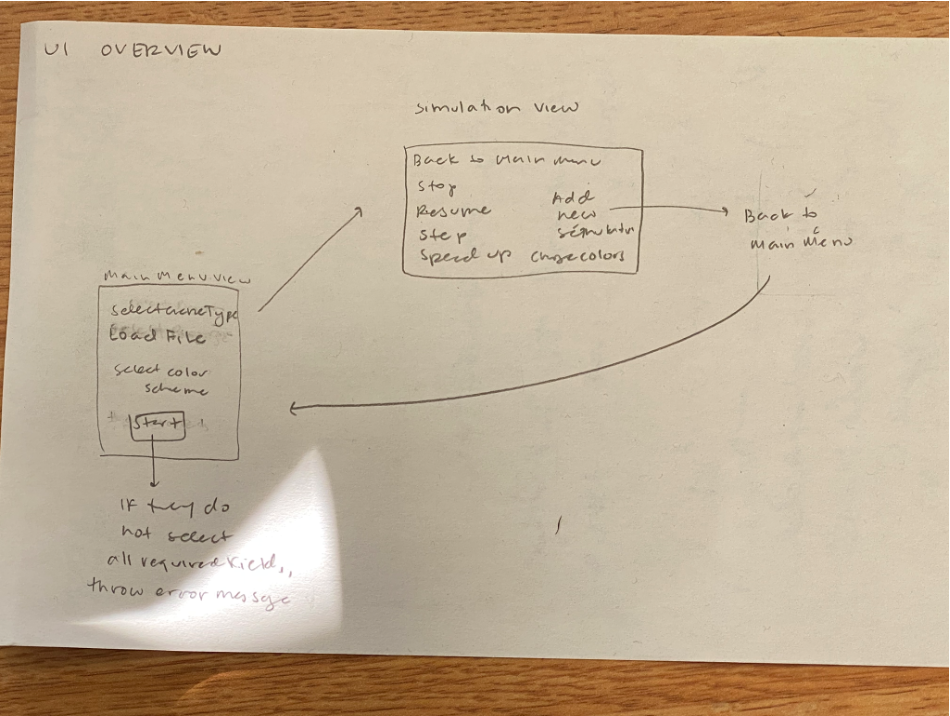

# Cell Society Design Plan
### Team Number: 10
### Names: Ryleigh Byrne (rmb96), Haseeb Chaudhry (hac21), Young Jun (yj112), Norah Tan (xt22)


## Design Overview

Main:

|Main| |
|---|---|
|start()|	|MainMenuView|

View:

This class’s purpose is to create a scene for the game and create a simulation

|SimulatorView| |
|---|---|
|Scene createSimulatorScene         |Model|
|void step()         |Model.Update()|

This class’s purpose is to display the buttons and the simulations of the games

|MainMenuView| |
|---|---|
|void step()         |simulatorController)|
|Scene gameDisplay() |ButtonView |

This class’s purpose is to update the cell’s visual behavior and information

|cellView|	|
|---|---|
|updateLocation()|	|cellController|
|updateColor()|	|cellController|
|cellHasBeenClicked()| 	|cellController|


Controller:

This class's purpose is update the cell’s status based on model/view

|CellController| |
|---|---|
|Point updateLocation         |cellModel, cellView|
|Point updateCellStatus         |cellModel, cellView|
|int getCellStatus    		 | |

This abstract class’s purpose is to receive and communicate button/click actions from view to model

|SimulatorController| |
|---|---|
|createNewSimulation|	|simulatorView, game| 

This class’s purpose is to update model when simulation is pause

|PauseController extends ActionController| |
|---|---|
|@override actionTriggered(boolean true/false)	|	|
|@override updateModel()				|Model.update(false)|


This class’s purpose is to update model when simulation is resumed

|PauseController extends ActionController| |
|---|---|
|@override actionTriggered(boolean true/false)	|	|
|@override updateModel()				|Model.update(true)|

This class’s purpose is to update model when simulation is resumed

|ResumeController extends ActionController| | 
|---|---|
|@override actionTriggered(boolean true/false)	|	|
|@override updateModel()				|Model.update(true)|


This class’s purpose is to update model when simulation should be stepped through

|StepController extends ActionController| | 
|---|---|
|@override actionTriggered(boolean true/false)	|	|
|@override updateModel()				|Model.update(true)|

Model:

This class’s purpose is to create the grid for the game by storing new cells and xy positions

|Grid| |
|---|---|
|expandGrid()	| Game|


This class’s purpose is to model the behavior of each game cell

|Cell| |
|---|---|
|getNeighborCells()         |Game|


This class’s purpose is to model the evolution of the game

|Game| |
|---|---|
|void update()         |SimulatorView.step()|
|void applyRule()		||
|int[][] toGridArray()	||
|void saveCSVFile()	||


This class extends Game class and it’s specific to the Game of Life application

|GameOfLife| |
|---|---|
|@Override void update()         |SimulatorView.step()|
|@Override void applyRule()		||

This class reads CSV file and output a 2d array for the grid

|ReadCSVFile| |
|---|---|
|int[][] read()         |Game|


## Design Details


### Use Cases

* Apply the rules to a cell: set the next state of a cell to dead by counting its number of neighbors using the Game of Life rules for a cell in the middle (i.e., with all of its neighbors)
```java
public class Cell {
    public void gameupdate(Grid) {
        for (each cell : Grid) {
            int state = observe(cell);
            update(state, cell);
        }
    }

    public int observe(cell) {
        ask cell what it’s neighbor’s are upto
        use ALGORITHM to determine new state
        return new state
    }
}
```

* Move to the next generation: update all cells in a simulation from their current state to their next state
```java
public class Game {
    public void update() {
        for (Cell c : myGrid.values()) c.observe();
        for (Cell c : myGrid.values()) c.changeStatus();
    }
}
```

* Switch simulations: load a new simulation from a data file, replacing the current running simulation with the newly loaded one
```java
SimulatorView newSimulation = new SimulatorView(filePath);
simulationList.set(simulationList.get(oldSimulation), newSimulation);
SimulatorView.gameDisplay;
```


## Design Considerations

#### Design Issue #1

The role of the controller. Currently, we have Main call View, then View calls Controller, and Controller calls backend classes and methods.

 * Alernative #1

We could have Main instantiate controller and the controller can connect the back-end and front-end.

 * Trade-offs

The alternative design would reduce (or eliminate) dependencies between each component. Hence, it would make it easy to add new features. However, we have already written code based on our original design. Therefore, it is hard for us to implement the alternative design before the deadline. We will change our design to reflect the alternative design after the first deadline.


#### Design Issue #2
How to apply different rules specific to each game. Currently, we decide to add a function called applyRule to each game class. Then, in update function, we can call applyRule to change each Cell’s nextStatus.

* Alternative #1 and its trade-off

At first, we thought how each Cell observes and changes its nextStatus should be a function in Cell because that’s Cell’s behavior. But that would complicate the entire design because we have only one Cell class but multiple rules to implement on Cells according to games. So it would be better to make rule a property in Game, rather than Cell.

* Alternative #2 and its trade-off

Another alternative design is to make Rule classes, like what we did in oolala’s Command classes. However, the logic of implementing Rule classes would be a lot different from that of the Command classes and it won’t be as straightforward as making applyRule a method in Game.


## User Interface

Here is our amazing UI:



[comment]: <> (taken from [Brilliant Examples of Sketched UI Wireframes and Mock-Ups]&#40;https://onextrapixel.com/40-brilliant-examples-of-sketched-ui-wireframes-and-mock-ups/&#41;.)


## Team Responsibilities

* Team Member #1 Ryleigh Byrne - working on front-end (specifically view and controller classes)

* Team Member #2 Young Jun - working on front-end and testFx front-end testing.

* Team Member #3 Norah Tan - working on back-end (component classes, game classes, testing)

* Team Member #4 Haseeb Chaudhry - working on back-end (component classes, game classes, testing)


#### Proposed Schedule

* Oct19 - Complete Game of Life 
* Oct22 - Complete Spreading of Fire 
* Oct25 - Complete Schelling's model of segregation 
* Oct27 - Complete Wa-Tor World model of predator-prey relationships 
* Oct31 - Complete CompSci 201's old Percolation assignment 
* Nov1 - Review and submit
